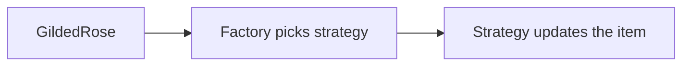
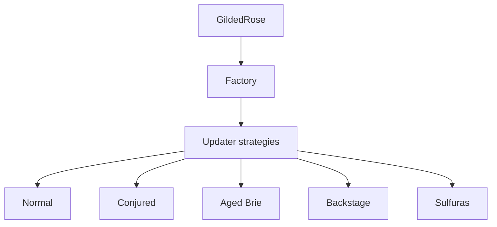

# Architecture

How the inventory update system is structured after the refactor.

## Idea

Each item type has its own update strategy. A shared base defines the daily steps; each strategy only fills in how that item’s quality (and sell-by date) should change.

## Daily flow

For every item, once per day:

1. **Pick** the strategy from the item’s name  
2. **Update quality** for that day  
3. **Move the sell-by date** forward one day (except legendary items)  
4. **If past sell-by**, apply the expired rule for that strategy  

## Main pieces

| Piece | Role |
|-------|------|
| **GildedRose** | Runs the daily update over all items |
| **Factory** | Chooses which strategy matches an item |
| **Updaters** | One strategy per item category |
| **Item** | Holds name, days left to sell, and quality (unchanged data shape) |

## Design choices

- **Strategy per category** — rules stay separate; a new product type means a new strategy and a factory mapping, not a bigger central method.  
- **Shared base updater** — the day sequence is the same for everyone; only the quality rules differ.  
- **Item left alone** — required constraint; behaviour lives in updaters, not on the item type.

## Adding a new product type

1. Add a new updater strategy  
2. Teach the factory when to use it  
3. Cover it with tests  

No change to the item model or the main update loop is needed.

For what each product type should do commercially, see [Business rules](BUSINESS_RULES.md).
